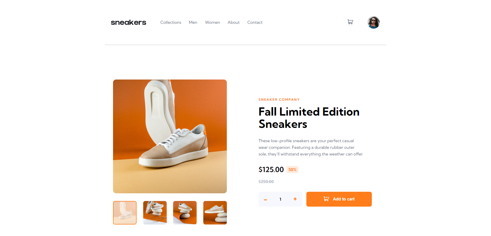

# Frontend Mentor - E-commerce product page solution

This is a solution to the [E-commerce product page challenge on Frontend Mentor](https://www.frontendmentor.io/challenges/ecommerce-product-page-UPsZ9MJp6). Frontend Mentor challenges help you improve your coding skills by building realistic projects.

## Table of contents

- [Overview](#overview)
  - [The challenge](#the-challenge)
  - [Screenshot](#screenshot)
  - [Links](#links)
- [My process](#my-process)
  - [Built with](#built-with)
  - [What I learned](#what-i-learned)
  - [Useful resources](#useful-resources)
- [Author](#author)

## Overview

### The challenge

Users should be able to:

- View the optimal layout for the site depending on their device's screen size
- See hover states for all interactive elements on the page
- Open a lightbox gallery by clicking on the large product image
- Switch the large product image by clicking on the small thumbnail images
- Add items to the cart
- View the cart and remove items from it

### Screenshot

### Links

- Live Site URL: [Add live site URL here](https://kriosaber.github.io/ecommerce-product-page-main/)

## My process

### Built with

- Semantic HTML5 markup
- CSS custom properties
- Flexbox
- CSS Grid
- Mobile-first workflow
- Autoprefixer
- JavaScript
- Local Storage

### What I learned

- I got a better understanding of positioning by making the mobile navbar fixed as well as the lightbox. 
- I learned about different functionalities in general, like making carousels, lightboxes, viewport fixed navbars and shopping carts
- The use of the Intl object for currency number formatting

### Useful resources

- [Change Color of SVG on Hover](https://css-tricks.com/change-color-of-svg-on-hover/) - This helped me to understand a little more about how svg works with CSS and HTML. 

## Author

- Frontend Mentor - [@Kriosaber](https://www.frontendmentor.io/profile/Kriosaber)

